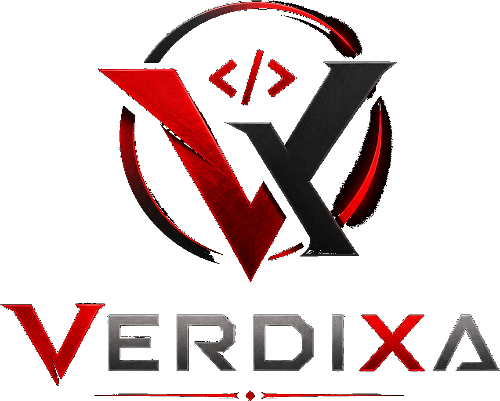
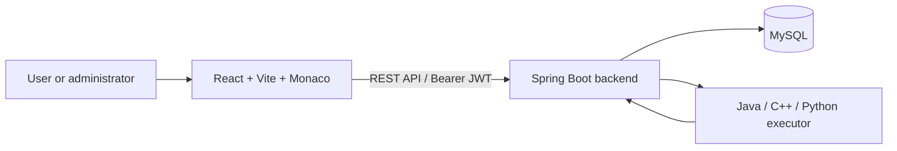

<p align="center"></p>

# Verdixa

[](https://github.com/Dark-Matter007/Verdixa/actions/workflows/ci.yml)


**A full-stack programming assessment platform with multi-language execution, dual-mode judging, and role-based administration.**

Verdixa lets users discover and solve programming problems in a Monaco-powered editor, run custom cases, submit against official tests, and review progress. Administrators manage problems, test cases, users, collections, learning paths, daily challenges, and platform analytics from the same application.

## Overview

Verdixa implements a practical online-judge workflow:

```text
User → React frontend → Spring Boot REST API → judge/executor → MySQL → submissions and progress
```

Users authenticate with JWTs, browse the problem library, write a Java, C++, or Python solution, run custom cases, and submit official solutions. The backend evaluates the submission, persists the result, and exposes histories and progress views. Admin-only routes provide content and platform management.

## Key Features

### User workspace

- Registration, login, JWT-protected routes, and profile/progress analytics.
- Searchable problem library with difficulty, topic, status, bookmark, and sorting filters.
- Monaco editor with Java, C++, and Python starter code.
- Custom **Run** workflow for STDIN and FUNCTION problems.
- Official **Submit** workflow with public and hidden test cases.
- Submission history, detail/replay, private notes, bookmarks, and personal problem lists.
- Editorials, curated collections, learning paths, daily challenges, leaderboard, and activity heatmap.

### Admin workspace

- Platform statistics, activity, user analytics, and problem analytics.
- Create, edit, activate/deactivate, and delete problems.
- Test-case management, including hidden cases and FUNCTION signatures.
- User and role management, collections, learning paths, daily challenges, and editorials.

## Judge Architecture

The backend executes submissions through `ProcessBuilder` and has language-specific paths for Java, C++, and Python.

1. A source file is created in a per-execution temporary directory.
2. Compiled languages are compiled before execution; compilation is limited to 30 seconds.
3. The generated program is run with supplied standard input where applicable; runtime is limited to 5 seconds.
4. Combined process output is captured, compared with expected output, and represented in a submission result.
5. Temporary execution files are cleaned up after the attempt.

The judge reports `ACCEPTED`, `WRONG_ANSWER`, `COMPILATION_ERROR`, `RUNTIME_ERROR`, and `TIME_LIMIT_EXCEEDED` where applicable. Output is normalized before STDIN comparison; FUNCTION results are parsed and compared using declared types, including tolerant floating-point comparison.

### STDIN and FUNCTION modes

| Mode | Submission contract | Evaluation approach |
| --- | --- | --- |
| **STDIN** | A complete program | Verdixa writes each test input to standard input and compares normalized standard output to the expected result. |
| **FUNCTION** | Only the requested method/function | Verdixa validates the signature, generates a language-specific wrapper, materializes typed arguments, invokes the user function, and compares the typed return value. |

FUNCTION mode supports function name, ordered parameters, and return type metadata. Supported values are `int`, `Integer`, `long`, `double`, `boolean`, `String`, `int[]`, `long[]`, `double[]`, and `String[]`.

### Supported languages

| Language | Executor |
| --- | --- |
| Java | Configured `javac` + `java` runtime |
| C++ | Configured `g++` compiler/runtime |
| Python | Configured Python interpreter |

The local defaults are configurable through environment variables. The Docker backend image installs Temurin JDK 21, `g++`, and Python 3.

## Technology Stack

| Layer | Technology |
| --- | --- |
| Frontend | React 19, React Router 7, Vite 8, Axios, Lucide |
| Editor | Monaco Editor (`@monaco-editor/react`) |
| Backend | Java 21, Spring Boot 4.1.1, Spring MVC, Bean Validation |
| Security | Spring Security, JJWT, BCrypt |
| Persistence | Spring Data JPA / Hibernate, MySQL 8 |
| Testing | JUnit, Spring Boot test starters, H2 (test scope), Vitest, React Testing Library |
| Delivery | Docker, Docker Compose, Nginx, GitHub Actions |

## System Architecture



## Project Structure

```text
Verdixa/
├── frontend/
│   ├── src/                 # React routes, pages, components, styles, API client
│   ├── public/              # Static assets
│   ├── Dockerfile           # Vite build served by Nginx
│   └── package.json
├── backend/
│   ├── src/main/java/       # Controllers, services, entities, DTOs, security, executor
│   ├── src/main/resources/  # Spring configuration
│   ├── src/test/            # Unit, integration, and judge tests
│   ├── Dockerfile
│   └── pom.xml
├── .github/workflows/ci.yml
├── docker-compose.yml
├── .env.example
└── README.md
```

## Data Model

- **User** owns submissions, personal lists, notes, and bookmarks; roles are `USER` or `ADMIN`.
- **Problem** stores statement metadata, difficulty, tags, starter code, execution mode, and optional function signature.
- **TestCase** belongs to a problem and can be public or hidden; FUNCTION cases carry arguments in parameter order.
- **Submission** links a user and problem to source code, language, verdict, timing, test counts, and timestamps.
- **ProblemList**, **ProblemBookmark**, and **ProblemNote** support personal organization.
- **CuratedCollection**, **LearningPath**, and **DailyChallenge** organize published learning content around problems.
- **Editorial** stores structured explanations and language-specific reference solutions for a problem.

## Authentication and Authorization

Verdixa uses stateless Spring Security with Bearer JWTs. Tokens include the authenticated username and role and expire after 24 hours. Passwords are stored using BCrypt.

- `/api/auth/**` and `/api/health` are public.
- `USER` and `ADMIN` roles are enforced by the backend, not only frontend route guards.
- Admin-only endpoints protect user management, administrative analytics, problem mutations, and hidden-test management.
- Submission, note, list, and bookmark access includes ownership checks or role checks as appropriate.

## Security and Execution Boundaries

- JWT signing secrets and database credentials are environment-driven; no signing key is committed.
- DTOs and dedicated response projections keep passwords and hidden-test payloads out of standard user responses.
- Direct execution endpoints limit source to 200,000 characters and custom input to 64,000 characters.
- The executor uses timeouts and temporary-directory cleanup.

> **Important:** execution uses host processes. This is appropriate for local development and demonstration, but is not a hardened hostile-code sandbox. Production deployment needs isolated workers, OS/container resource controls, and stronger tenancy boundaries.

## Prerequisites

- Git
- Java 21 and Maven 3.9+
- Node.js 22+ and npm
- MySQL 8+ for local persistence
- Java compiler/runtime, `g++`, and Python available to the backend process for local judging
- Docker Desktop (optional, for Compose)

## Local Installation

```bash
git clone https://github.com/Dark-Matter007/Verdixa.git
cd Verdixa
```

### 1. Configure MySQL

The default local database is named `leetcode_platform`:

```sql
CREATE DATABASE leetcode_platform;
```

Copy the environment template and fill in values appropriate for your machine:

```bash
cp .env.example .env
```

On Windows PowerShell, use `Copy-Item .env.example .env` instead. The backend reads environment variables directly; `.env` is particularly convenient for Docker Compose.

### 2. Run the backend

From `backend/`, set the following environment variables, then start Spring Boot:

```bash
export ALGOSPHERE_DB_URL='jdbc:mysql://localhost:3306/leetcode_platform'
export ALGOSPHERE_DB_USERNAME='root'
export ALGOSPHERE_DB_PASSWORD='your-mysql-password'
export ALGOSPHERE_JWT_SECRET='replace-with-a-random-secret-of-at-least-32-characters'
mvn spring-boot:run
```

PowerShell equivalents use `$env:NAME = 'value'`. The API listens on `http://localhost:8080`; check it with:

```bash
curl http://localhost:8080/api/health
```

To deliberately seed a local bootstrap admin, set both `ALGOSPHERE_BOOTSTRAP_ADMIN_USERNAME` and `ALGOSPHERE_BOOTSTRAP_ADMIN_PASSWORD` before startup. No default administrator is created.

### 3. Run the frontend

In a second terminal:

```bash
cd frontend
npm install
export VITE_API_BASE_URL='http://localhost:8080/api'
npm run dev
```

Open `http://localhost:5173`.

## Environment Variables

The names below are retained for compatibility with the existing configuration; they are internal configuration names, while the product is Verdixa.

| Variable | Purpose | Default / example |
| --- | --- | --- |
| `ALGOSPHERE_DB_URL` | MySQL JDBC URL | `jdbc:mysql://localhost:3306/leetcode_platform` |
| `ALGOSPHERE_DB_USERNAME` | MySQL user | `root` |
| `ALGOSPHERE_DB_PASSWORD` | MySQL password | empty locally |
| `ALGOSPHERE_JWT_SECRET` | JWT HMAC signing secret; required, 32+ characters | no safe default |
| `ALGOSPHERE_BOOTSTRAP_ADMIN_USERNAME` | Explicit bootstrap-admin username | unset |
| `ALGOSPHERE_BOOTSTRAP_ADMIN_PASSWORD` | Explicit bootstrap-admin password | unset |
| `ALGOSPHERE_JAVAC_COMMAND` / `ALGOSPHERE_JAVA_COMMAND` | Java tool commands | `javac` / `java` |
| `ALGOSPHERE_CPP_COMMAND` | C++ compiler command | platform-specific `g++` path locally |
| `ALGOSPHERE_PYTHON_COMMAND` | Python command | `python` locally, `python3` in Compose |
| `ALGOSPHERE_RUNTIME_PATH` | Extra process runtime path | platform-specific |
| `VITE_API_BASE_URL` | Frontend API base URL | `http://localhost:8080/api` locally |

## Docker Compose

Docker Compose starts MySQL 8.4, the Spring Boot API, and an Nginx-hosted frontend. Nginx proxies `/api` to the backend and falls back to `index.html` for client-side routes.

```bash
cp .env.example .env
# Set a strong ALGOSPHERE_JWT_SECRET in .env
docker compose up --build
```

The Compose frontend is exposed at `http://localhost:5173`; the API is exposed at `http://localhost:8080`.

## Build and Test

```bash
# Backend
cd backend
mvn clean test
mvn package

# Frontend
cd ../frontend
npm run lint
npm test -- --run
npm run build
```

Backend tests use isolated H2 configuration and do not destructively test the development MySQL database. GitHub Actions runs backend tests/package and frontend lint, tests, and production build for pushes and pull requests.

## API Overview

All application APIs are under `/api`.

| Area | Representative routes |
| --- | --- |
| Authentication | `/auth/register`, `/auth/login` |
| Users and progress | `/users/me`, `/users/me/progress`, `/users/leaderboard` |
| Problems | `/problems/library`, `/problems/{id}`, `/problems/{id}/navigation` |
| Test cases | `/problems/{problemId}/testcases` |
| Execution | `/execution-test/run`, `/execution-test/java`, `/execution-test/cpp`, `/execution-test/python` |
| Submissions | `/submissions?problemId=…&language=…`, `/submissions/{id}` |
| Learning content | `/bookmarks`, `/lists`, `/collections`, `/learning-paths`, `/daily-challenges` |
| Administration | `/admin/**`, `/users/**`, administrative problem and test-case routes |

Refer to the controller classes under `backend/src/main/java/com/leetcode/backend/controller/` for request and response details.

## Example Workflow

1. Register or log in.
2. Browse and filter the problem library.
3. Open a problem and select Java, C++, or Python.
4. Write a solution in Monaco and run custom input/cases.
5. Submit the solution.
6. Verdixa evaluates official public and hidden test cases.
7. Review the verdict, per-case summary, timing, and persisted submission history.
8. Track progress through the profile, leaderboard, daily challenge, and learning content.

For a FUNCTION problem, a Python submission can be limited to the requested function:

```python
def reverse_string(s):
    return s[::-1]
```

Verdixa generates the language-specific harness, supplies the configured typed arguments, normalizes the return value, and compares it with the expected result. Hidden values are not returned to regular users.

## Engineering Highlights

- A dual STDIN/FUNCTION judge model supports both full-program and interview-style method submissions.
- Typed FUNCTION argument validation and wrapper generation keep the contract consistent across three languages.
- REST, JPA, and DTO boundaries separate the user interface, application logic, persistence, and response shaping.
- Spring Security RBAC protects privileged management paths while ownership checks guard personal resources.
- Docker Compose provides a reproducible three-service local stack; CI validates both frontend and backend builds.

## Current Architectural Boundaries

- Submissions execute as local host processes, not isolated per-submission containers or remote workers.
- The backend is a single Spring Boot service; judging is synchronous rather than queue-backed/distributed.
- The supported FUNCTION type system is intentionally limited to the scalar and array types listed above.
- CORS is configured for the local Vite origin (`http://localhost:5173`); production origins must be configured deliberately.

<!-- BENCHMARK_RESULTS:START -->
## Performance & Evaluation

> All values in this section are generated from committed raw JSON by `python benchmarks/generate_report.py`.

### Test Environment

Windows (Microsoft Windows NT 10.0.26200.0); 16 logical processors; java version "21.0.3" 2024-04-16 LTS; Python 3.11.5; H2 in-memory 2.x (benchmark Maven profile; MySQL is not measured). Total system RAM was unavailable to the restricted local shell.

### Benchmark Methodology

The measured production read path is authenticated `GET /api/problems/library?size=100`. Each clean run starts the `benchmark` Spring profile with an in-memory H2 database seeded with 1 user, 100 active problems, and 1,000 submissions. Each level has a 10-second warm-up and 20-second measurement window. This is a local H2 result, not a MySQL, Docker, or multi-host claim. Raw inputs are [baseline results](benchmarks/results/baseline/) and [optimized results](benchmarks/results/optimized/).

### Scale Test and Performance Results

| Concurrent clients | Baseline RPS | Optimized RPS | Baseline p50 / p95 / p99 (ms) | Optimized p50 / p95 / p99 (ms) | Error rate |
| ---: | ---: | ---: | --- | --- | ---: |
| 1 | 10.965 | 27.150 | 89.352 / 114.871 / 121.971 | 36.786 / 51.299 / 55.931 | 0.0000% → 0.0000% |
| 4 | 41.410 | 144.492 | 95.268 / 119.666 / 130.990 | 26.562 / 45.213 / 52.855 | 0.0000% → 0.0000% |
| 8 | 68.627 | 269.534 | 114.708 / 142.250 / 160.218 | 27.473 / 50.915 / 60.894 | 0.0000% → 0.0000% |

| Concurrent clients | Throughput change | p95 reduction |
| ---: | ---: | ---: |
| 1 | +147.61% | 55.34% |
| 4 | +248.93% | 62.22% |
| 8 | +292.75% | 64.21% |

### Baseline vs Optimized

The optimization replaces per-problem submission-row loading in the library response with one grouped aggregate query. It preserves the response fields while avoiding repeated database round trips. The largest tested level was 8 concurrent clients; it completed without request errors in both passes. No saturation point above 8 clients was measured, so none is claimed.

### Reliability Testing

The local automated checks cover unauthenticated protected access, malformed login JSON, and invalid credentials; their exact observed statuses are in [reliability.json](benchmarks/results/reliability.json). Redis, queues, workers, and an external database are not part of this repository's local architecture, so cache/queue/database-restart metrics are not applicable to this run.

### Reproducing the Benchmark

See [benchmarks/README.md](benchmarks/README.md). Run `powershell -ExecutionPolicy Bypass -File benchmarks/run_local.ps1 -Label baseline`, apply/verify the target change, run the identical command with `-Label optimized`, then run `python benchmarks/generate_report.py`.
<!-- BENCHMARK_RESULTS:END -->

## Future Improvements

- Containerized or VM-isolated execution workers with resource limits.
- Queue-backed and horizontally scalable judging.
- Additional languages and richer FUNCTION types.
- Production CORS/origin configuration, rate limiting, and observability.
- Real-time result delivery, contest workflows, and expanded analytics.

## Screenshots

The repository does not currently include UI screenshots. Add project-owned images here as the interface evolves, for example login/registration, the problem library and solver, submission history, and the admin workspace.

## Deployment Strategy

No hosted deployment URL is configured in this repository. The included Dockerfiles and Compose configuration provide a foundation for deployment: build the React frontend into Nginx, run the Spring Boot API with the required language runtimes, and provide a managed MySQL instance. A production judge should use the isolated-worker approach described above.

## What This Project Demonstrates

Verdixa demonstrates full-stack system design across React UI workflows, REST API design, JWT/RBAC security, relational modeling, multi-language process execution, automated judging, testable backend services, and CI-backed builds.

## Contributing

1. Create a branch: `git checkout -b feature/your-feature`
2. Make focused changes and run the relevant tests.
3. Commit with a clear message: `git commit -m "Add your feature"`
4. Push the branch and open a pull request.

## License

No license has currently been specified for this repository.

## Author

Built by [Dark-Matter007](https://github.com/Dark-Matter007).

## Repository

<https://github.com/Dark-Matter007/Verdixa>
